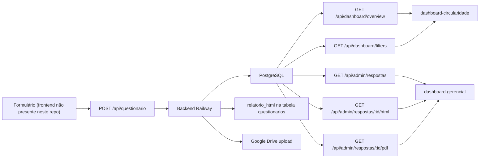

# Análise de Instabilidade dos Aplicativos

## Escopo

Este documento consolida a análise do fluxo operacional dos três aplicativos desta base:

1. Formulário principal.
2. Dashboard analítico.
3. Dashboard gerencial.

O objetivo é explicar:

- onde o fluxo depende de cada componente;
- quais são os pontos críticos;
- quais são os single points of failure;
- qual é o gargalo estrutural do sistema;
- por que, em alguns casos, o sistema “parou de gerar o relatório final”.

Este diagnóstico foi feito com base no código presente neste repositório, sem alterar nenhum arquivo.

## Status Das Correções

Alguns pontos críticos descritos abaixo já foram tratados no código desta pasta:

- o upload do Google Drive passou a ocorrer em segundo plano, sem bloquear a resposta principal do formulário;
- a coluna `relatorio_html` passou a ter migration explícita em `backend/migrations/2026-06-19-add-relatorio-html.sql`;
- o painel gerencial agora declara `ACCESS_TOKEN_KEY` e remove o bug de `ReferenceError`;
- `APPS.md` foi alinhado com a estrutura real dos aplicativos da pasta.

## Resumo Executivo

O sistema não é instável por causa de um único bug. A instabilidade é estrutural:

- existe um backend central na Railway que atende todos os apps;
- o backend concentra gravação do formulário, persistência do HTML do relatório e upload para Google Drive;
- os dashboards dependem do mesmo backend e do mesmo banco;
- o painel gerencial possui um bug real de frontend que pode piorar a falha quando a API responde com erro;
- o contrato entre documentação, deploy e implementação apresenta divergências.

Em termos práticos, o sistema tem um ponto central de fragilidade:

- se a Railway, o PostgreSQL, a coluna `relatorio_html`, ou o Google Drive falham, o efeito aparece em cadeia;
- como o fluxo de submissão do formulário é acoplado a várias dependências no mesmo request, qualquer falha na etapa final pode impedir a geração do relatório.

## Mapa End-to-End

O fluxo observado no código é este:

## Fluxo Operacional

### 1. Formulário

O frontend do formulário não está presente nesta pasta, então a análise do primeiro trecho é inferida a partir do backend e dos dashboards.

O comportamento esperado é:

- usuário preenche o questionário;
- o frontend monta os dados da empresa, respostas, pontuação e HTML do relatório;
- o frontend envia tudo para `POST /api/questionario`.

### 2. `POST /api/questionario`

O backend recebe:

- `empresa`;
- `respostas`;
- `pontuacao`;
- `relatorioHtml`.

Em seguida ele executa, em sequência:

1. valida e normaliza dados;
2. verifica se a empresa já existe;
3. insere ou atualiza a empresa;
4. insere o questionário;
5. grava `relatorio_html` quando a coluna existe;
6. tenta salvar o relatório no Google Drive, se houver autenticação;
7. responde ao cliente.

Esse encadeamento é importante: o fluxo de negócio está concentrado em um único request e em uma única transação lógica.

### 3. PostgreSQL

O PostgreSQL é a fonte de verdade operacional para:

- listagem dos questionários;
- indicadores do dashboard;
- relatórios PDF;
- HTML do relatório, quando persistido.

Os dashboards não leem o Google Drive como fonte primária.

### 4. `relatorio_html`

O HTML do relatório é um recurso opcional e condicional:

- o backend detecta se a coluna `relatorio_html` existe;
- se a coluna existir, grava o HTML;
- se não existir, tenta criar automaticamente;
- se essa criação falhar, a persistência do HTML fica indisponível.

### 5. Google Drive

O Google Drive é um efeito colateral de arquivamento, não a base do sistema.

Ele depende de:

- `GOOGLE_CLIENT_ID`;
- `GOOGLE_CLIENT_SECRET`;
- `GOOGLE_REFRESH_TOKEN`;
- token de acesso válido;
- API do Google funcional;
- permissão de upload.

Se essa etapa falhar, o questionário pode até ter sido salvo no banco, mas o relatório não será arquivado no Drive.

### 6. Dashboards

Os dashboards leem do mesmo backend e do mesmo banco:

- `dashboard-circularidade` consome `/api/dashboard/overview` e `/api/dashboard/filters`;
- `dashboard-gerencial` consome `/api/admin/respostas`, `/api/admin/respostas/:id/html` e `/api/admin/respostas/:id/pdf`.

Logo, qualquer problema na API ou no banco afeta os dois dashboards ao mesmo tempo.

## Pontos Críticos

### 1. Backend central único

O maior ponto crítico é a centralização do sistema em um backend único na Railway.

Conseqüências:

- qualquer indisponibilidade da Railway derruba todos os apps;
- qualquer regressão no backend impacta gravação, dashboard analítico e painel gerencial;
- qualquer mudança de contrato no backend precisa ser refletida em todos os frontends.

### 2. Banco único como fonte de verdade

O PostgreSQL é o coração dos dados.

Conseqüências:

- se houver falha de credencial, rede ou schema, o sistema inteiro perde consistência;
- se a tabela ou coluna esperada não existir, os relatórios deixam de ser persistidos corretamente;
- dashboards ficam vazios, incompletos ou quebrados.

### 3. Persistência condicional do HTML

O campo `relatorio_html` não é garantido em todos os ambientes.

Conseqüências:

- o HTML pode não ser salvo;
- o painel gerencial pode perder o endpoint `/html`;
- o sistema cai para PDF como fallback;
- o usuário percebe que “o relatório final parou de aparecer”.

### 4. Google Drive como dependência externa no caminho crítico

O upload para o Drive está acoplado ao salvamento do questionário.

Conseqüências:

- problemas de autenticação Google quebram a etapa final;
- refresh token ausente ou inválido impede o upload;
- falha externa aumenta a variabilidade do comportamento do sistema.

### 5. Contrato de autenticação duplicado

O backend usa `ADMIN_PANEL_TOKEN` via query/header.
O frontend gerencial usa senha hardcoded.

Conseqüências:

- se o valor divergir entre ambiente e frontend, o acesso quebra;
- a autenticação é fraca no cliente e depende de coerência manual;
- erros de 401/403 precisam ser tratados com cuidado.

### 6. Bug real no dashboard gerencial

O painel gerencial tem um erro concreto:

- no `catch` do carregamento ele chama `sessionStorage.removeItem(ACCESS_TOKEN_KEY)`;
- `ACCESS_TOKEN_KEY` não existe nesse arquivo.

Conseqüência:

- se a API responder com erro de autenticação, o painel pode lançar `ReferenceError`;
- isso piora a percepção de instabilidade quando o backend já está sob falha.

### 7. Divergência entre documentação e implementação

A documentação da raiz está inconsistente com os arquivos reais desta pasta:

- `APPS.md` descreve o `index.html` da raiz como formulário principal;
- o `index.html` real da raiz é um painel de relatórios;
- `README.md` também descreve esse painel;
- o formulário principal não está presente neste conjunto de arquivos.

Conseqüência:

- aumenta a chance de deploy ou manutenção em artefatos errados;
- dificulta diagnóstico;
- gera suposições incorretas sobre onde o formulário realmente vive.

## Single Points of Failure

| Ponto | Local | Por que é single point of failure | Impacto provável |
|---|---|---|---|
| Backend único | `backend/server.js` | Todos os apps dependem da mesma API na Railway | Queda simultânea dos 3 apps |
| PostgreSQL único | `backend/server.js` | Fonte de verdade de leitura e escrita | Falhas de leitura, gravação e dashboards |
| `POST /api/questionario` monolítico | `backend/server.js` | Faz múltiplas etapas no mesmo request | Submissão final pode falhar inteira |
| `relatorio_html` condicional | `backend/server.js` | O HTML depende da existência da coluna | Relatório HTML some ou deixa de ser salvo |
| Google Drive | `backend/google-drive-service.js` | Depende de credenciais, token e API externa | Arquivamento falha |
| Auth do painel gerencial | `dashboard-gerencial/index.html` | Senha e token precisam ser coerentes | Bloqueio indevido ou quebra de acesso |
| CORS/allowlist | `backend/server.js` | Só aceita origens específicas | Frontends podem parar de chamar a API |
| Base URL por hostname | `dashboard-circularidade/app.js`, `dashboard-gerencial/index.html` | O frontend escolhe a API com lógica local | Deploy fora do esperado quebra o acesso |

## Gargalo Estrutural

O gargalo principal não é computacional. É arquitetural.

### Onde está o gargalo

O sistema concentra em um único backend:

- autenticação administrativa;
- gravação do formulário;
- persistência do HTML final;
- geração de PDF;
- consumo analítico;
- acesso do painel gerencial;
- upload para Google Drive.

### Por que isso é um gargalo

Porque os passos estão acoplados no mesmo backend e, em alguns casos, no mesmo request.

Na prática:

- o formulário não termina apenas por gravar no banco;
- ele também depende de `relatorioHtml`, da existência do schema correto e do Google Drive;
- qualquer uma dessas partes pode bloquear ou degradar a experiência final.

### Efeito operacional

Esse gargalo produz sintomas recorrentes:

- o usuário conclui o formulário, mas a tela final não aparece;
- o dashboard analítico passa a refletir dados incompletos;
- o painel gerencial mostra HTML ausente e cai para PDF;
- o sistema parece “instável” mesmo quando parte dele ainda está funcionando.

## Causas Prováveis do “Parou de Gerar o Relatório Final”

Aqui estão as causas mais prováveis, em ordem de plausibilidade técnica:

### 1. Falha na gravação do `relatorioHtml`

Se o frontend não enviar `relatorioHtml`, ou se a coluna não existir, o HTML deixa de ser persistido.

Evidência no código:

- a persistência é condicional;
- o backend só adiciona `relatorio_html` se detectar a coluna;
- se a criação automática falhar, o sistema continua sem ela.

Efeito:

- o relatório final pode existir visualmente no frontend, mas não ser salvo para consumo posterior;
- o painel gerencial deixa de encontrar HTML;
- o sistema pode cair em PDF ou em ausência de relatório.

### 2. Erro ao salvar o questionário no PostgreSQL

Se houver falha de conexão, schema, credenciais, ou tabela inconsistente, o `POST /api/questionario` falha inteiro.

Efeito:

- não existe resposta persistida;
- o relatório não fica disponível para os dashboards;
- o usuário percebe que o ciclo final não completou.

### 3. Falha no Google Drive

O upload ao Drive está acoplado ao fluxo de submissão.

Possíveis causas:

- credenciais ausentes;
- refresh token ausente ou expirado;
- erro na renovação do token;
- falha de upload;
- permissão revogada.

Efeito:

- o banco pode até ter gravado os dados;
- mas a etapa de arquivamento falha;
- a percepção de “relatório final não gerado” aumenta quando a operação espera também um link externo.

### 4. Divergência entre frontend e backend

Se o formulário estiver enviando um formato diferente do esperado pelo backend, a submissão pode até ser aceita parcialmente, mas o relatório não ficará íntegro.

Isso é especialmente sensível porque o frontend do formulário não está neste repositório, então o contrato exato não pode ser verificado aqui.

Efeito:

- campos ausentes;
- `pontuacao` incompleta;
- `relatorioHtml` vazio;
- resultado final inconsistente.

### 5. Schema evolutivo não completamente sincronizado

O backend tenta se adaptar ao schema:

- detecta `uf`;
- detecta `relatorio_html`;
- tenta criar coluna em runtime.

Essa estratégia reduz ruptura imediata, mas cria instabilidade de longo prazo:

- ambientes podem ficar com comportamentos diferentes;
- um ambiente grava HTML, outro não;
- um ambiente tem `uf`, outro não;
- dashboards passam a depender de branches de schema.

### 6. Problemas de autenticação no painel gerencial

Quando a API responde com 401/403, o painel gerencial entra no trecho com `ACCESS_TOKEN_KEY` indefinido.

Efeito:

- a falha de autenticação pode virar falha de runtime;
- o usuário interpreta isso como “sistema instável”, embora o bug esteja no frontend.

## Diagnóstico por Sintoma

| Sintoma observado | Causa técnica mais provável |
|---|---|
| Usuário terminou o formulário e o relatório final não apareceu | Falha no `POST /api/questionario`, `relatorioHtml` ausente, schema inconsistente ou erro de Drive |
| Dashboard analítico abre vazio ou com erro | Backend indisponível, CORS, token ausente, dados não persistidos |
| Painel gerencial mostra poucos relatórios ou não abre HTML | `relatorio_html` ausente, 501/404 no endpoint HTML, ou `ACCESS_TOKEN_KEY` causando erro secundário |
| Mudanças funcionam em um ambiente e falham em outro | Schema/runtime divergem entre Railway, Netlify e banco |
| Upload para Google Drive some sem explicação | Refresh token, credenciais ou autenticação Google quebradas |

## Conclusão

A instabilidade dos aplicativos não é aleatória. Ela vem de uma arquitetura concentrada e sensível a dependências externas.

Os fatores mais graves são:

1. backend único para todos os apps;
2. PostgreSQL como fonte de verdade única;
3. gravação do relatório final acoplada ao mesmo request do formulário;
4. persistência condicional do `relatorio_html`;
5. Google Drive como dependência externa no caminho operacional;
6. bug real no dashboard gerencial;
7. documentação e implementação desalinhadas.

Se a meta é entender “por que isso quebra tanto”, a resposta curta é:

- porque o sistema opera como uma cadeia longa sem isolamento entre etapas críticas;
- quando uma etapa falha, as seguintes deixam de ter os dados ou o estado esperado;
- o resultado aparece como relatório final ausente, dashboard inconsistente ou painel quebrado.

## Ação Essencial de Correção

Este documento deve servir como base para uma ação corretiva focada nos problemas mais críticos. O objetivo não é melhorar cosmética ou adicionar recursos, e sim eliminar as causas estruturais da instabilidade.

### Ordem de prioridade

1. **Isolar a geração do relatório final do upload para Google Drive**
   - O envio do formulário não pode depender do Drive para concluir com sucesso.
   - A gravação no banco deve ser concluída primeiro.
   - O upload para o Drive deve ser tratado como processo secundário, com falha tolerada e registrada.
   - Resultado esperado: o formulário continua finalizando mesmo quando o Drive falha.

2. **Tornar a persistência do relatório final consistente**
   - `relatorio_html` precisa existir de forma estável em todos os ambientes.
   - A presença dessa coluna não pode depender de criação automática em runtime como única estratégia.
   - Resultado esperado: o relatório HTML deixa de sumir entre ambientes.

3. **Eliminar o bug do painel gerencial**
   - Corrigir o uso de `ACCESS_TOKEN_KEY` indefinido.
   - O tratamento de erro não pode criar uma nova exceção quando a API responde 401/403.
   - Resultado esperado: o painel falha de forma controlada, sem crash secundário.

4. **Padronizar o contrato entre frontend e backend**
   - O formato de `empresa`, `respostas`, `pontuacao` e `relatorioHtml` precisa ser o mesmo em todos os ambientes.
   - O frontend do formulário e a API precisam ter um contrato explícito e versionado.
   - Resultado esperado: menos regressões por divergência de payload.

5. **Separar falhas de infraestrutura de falhas funcionais**
   - É necessário identificar claramente quando o problema é banco, API, Drive, autenticação ou frontend.
   - Sem essa separação, cada incidente vira um diagnóstico genérico.
   - Resultado esperado: menos tempo perdido em investigação repetida.

### Critério de estabilização

O sistema só deve ser considerado estável quando, em um cenário de falha no Google Drive:

- o formulário ainda conclui a submissão;
- o registro é salvo no PostgreSQL;
- o relatório final continua disponível no banco, se essa for a política definida;
- os dashboards continuam operando com os dados persistidos;
- o painel gerencial não entra em erro secundário no tratamento da falha.

### O que precisa ser evitado

- fluxo único que faça tudo no mesmo request sem tolerância a falha;
- dependência de criação automática de schema em produção como mecanismo principal;
- fallback silencioso que esconda a causa real do problema;
- autenticação duplicada ou incoerente entre frontend e backend;
- erro primário que vira erro secundário por falta de tratamento defensivo.

## Próximo Passo Recomendado

Se você quiser continuar a investigação sem alterar nada, o passo mais útil agora é fazer uma análise de falhas por cenário:

1. falha de banco;
2. falha de `relatorio_html`;
3. falha de Google Drive;
4. falha de contrato entre frontend e backend;
5. falha de autenticação do painel gerencial.

## Plano de Correção

Este plano organiza a estabilização em fases. A lógica é simples:

- primeiro remover as causas que interrompem o fluxo principal;
- depois eliminar a variabilidade entre ambientes;
- por fim endurecer o sistema contra regressões.

### Fase 1. Estabilização do fluxo crítico

Objetivo: garantir que o usuário conclua o formulário mesmo que o Drive esteja indisponível.

Atividades:

1. Separar a gravação no PostgreSQL do upload para Google Drive.
2. Garantir que o `POST /api/questionario` finalize após a persistência do banco.
3. Tratar o Google Drive como etapa secundária, com falha registrada e não bloqueante.
4. Definir claramente o que é “sucesso” na submissão: banco gravado, relatório persistido, e Drive apenas opcional.

Critério de aceite:

- o formulário termina mesmo quando o Drive falha;
- o questionário fica gravado no banco;
- o relatório final não desaparece por erro externo;
- a API responde de forma consistente.

### Fase 2. Consistência do relatório final

Objetivo: impedir que o HTML do relatório some ou dependa de comportamento automático em runtime.

Atividades:

1. Tornar `relatorio_html` uma exigência explícita do schema de produção.
2. Eliminar a dependência de criação automática de coluna como mecanismo principal.
3. Garantir que a geração do relatório HTML tenha contrato estável com o frontend do formulário.
4. Validar que os endpoints de leitura do HTML e PDF retornem sempre o comportamento esperado.

Critério de aceite:

- `relatorio_html` existe e é usado de forma uniforme;
- o painel gerencial encontra o HTML quando ele foi salvo;
- o fallback para PDF é previsível e documentado.

### Fase 3. Correção do painel gerencial

Objetivo: eliminar falhas secundárias que amplificam erros de autenticação e acesso.

Atividades:

1. Corrigir a referência a `ACCESS_TOKEN_KEY` indefinida.
2. Garantir que erros 401/403 sejam tratados sem lançar novo erro de JavaScript.
3. Verificar a coerência entre a senha hardcoded do frontend e `ADMIN_PANEL_TOKEN` do backend.
4. Confirmar que a experiência de acesso bloqueado não gera travamentos extras.

Critério de aceite:

- o painel não quebra em erro de autenticação;
- o tratamento de falha é previsível;
- a autenticação segue um único contrato.

### Fase 4. Padronização dos contratos

Objetivo: reduzir regressões causadas por divergência entre ambiente, frontend e backend.

Atividades:

1. Documentar o payload esperado para `empresa`, `respostas`, `pontuacao` e `relatorioHtml`.
2. Validar esse contrato no backend antes de persistir.
3. Consolidar as URLs de API por ambiente de forma explícita.
4. Reduzir dependência de heurísticas baseadas em hostname.

Critério de aceite:

- o mesmo payload funciona em todos os ambientes oficiais;
- os dashboards continuam acessando a API correta;
- mudanças de deploy não quebram o contrato silenciosamente.

### Fase 5. Endurecimento operacional

Objetivo: tornar o sistema observável e menos sujeito a regressão.

Atividades:

1. Separar logs de falha de banco, falha de validação, falha de Drive e falha de autenticação.
2. Registrar explicitamente quando o relatório foi salvo no banco, no Drive, ou em ambos.
3. Criar um checklist de health checks para produção.
4. Definir um procedimento de verificação após deploy.

Critério de aceite:

- incidentes passam a ser classificados rapidamente;
- a causa raiz fica visível nos logs;
- o time consegue distinguir falha de infraestrutura de falha funcional.

## Ordem Recomendada de Execução

Se a execução tiver de ser priorizada, a sequência mais segura é:

1. remover a dependência crítica do Google Drive do caminho principal;
2. garantir persistência estável do relatório final no banco;
3. corrigir o bug do painel gerencial;
4. formalizar contratos e validações;
5. endurecer logs, monitoramento e checks de deploy.

Essa ordem é a mais eficaz porque ataca primeiro o que faz o usuário perder o relatório e depois o que produz instabilidade repetida.

Isso permite separar qual sintoma corresponde a qual causa, em vez de tratar tudo como um único problema.
